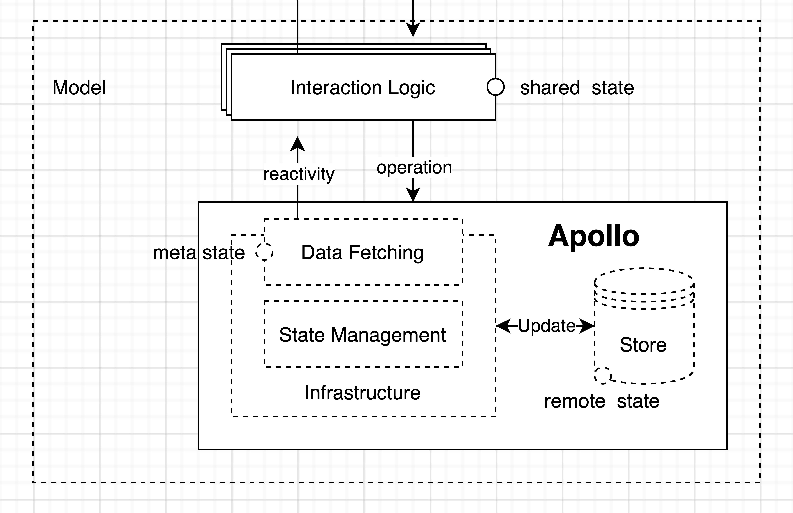

# Domain Driven Frontend

## Introduction
The main goal of this architecture is to allow us to easily maintain, scale and test our codebase. Secondarily it's designed to help us steadily build a vast reusable component library over time with minimal extra effort. It also provides a clear guideline on how to implement useful and chore free automated tests for our frontend code.

After you've read this, have a look through the code. Some directories have their own `README.md` file. Most files use comments to explain the more technical details or design decisions.

## The Concept
This architecture is based on the [Onion Layer Architectures](https://dev.to/barrymcauley/onion-architecture-3fgl) popularized in backend development.

To separate our concerns into more tangible concepts we separate our codebase into layers.

Practically, there are 3 notable layers:
1. The View Layer
2. The Presenter
3. The Interaction Layer

As you can see on the image above, there are actually a couple more layers. But we will only focus on these 3 as the others are being handled for us by Apollo.

## The View Layer
**Render the UI and create user events**

The View Layer consists of multiple, completely independent, reusable Presentation Components.
Their purpose is to:
1. Display data in the UI.
2. Generate user events (from key presses, button clicks, hover states, etc)

### Presentation components are an implementation detail.
An implementation detail is a low-level detail that helps us accomplish our *main* goal. But they are not our *main* goal. If our main goal is to hook up the `Add Todo` feature, the buttons, styling and text in the UI is an implementation detail in realising this feature.

### Presentation components can be volatile.
Anything subject to frequent change is said to be volatile. Us constantly changing the look and feel of components is what makes them so.

### What to test in presentation components.
Unit testing implementation details is typically fruitless - especially for volatile things. It doesn’t do us much good to test if a button is blue or green. Instead, when testing presentation components, we want to test against UI Logic. For this reason alone, we split up our View Layer in 2 separate sub-layers:
1. **The Presentation layer**: The visual styling and layout of the component.
2. **The UI logic**: The logic behind this specific component. This is what will be tested in unit tests.

## UI Logic
**View behavior & UI State**

“If you’re logged in, show this - otherwise, show this.”
“If you’re this type of user, show this - otherwise, show this.”
“Depending on which page you’re on in the sign up process, show the correct form.”

A component has UI logic when it exudes behavior. Conditionals that determine *what to show*, or *when certain user events get called over others* are a form of view behavior (UI logic).

### Component / local / UI state
This is the *first* type of state we might encounter. State that belongs to a single component. Can also be thought about as UI state.

### UI logic is what we actually try to test within components
Since UI logic is behavior, *this* is actually what we want to test against in our unit tests. The behavior. Throughout this demo project you'll notice that the unit tests for both UI Logic as the Interaction layer are quite excessive. The goal here was to showcase as many test scenarios as possible. In reality, in the way this architecture has been set up, unit tests don't always provide us that much extra confidence over our Integration tests. You don't *need* to test every single feature in your UI logic. There are usually only a couple reasons why a developer should choose to add unit tests.
1. **New to tests**: If you are having trouble with writing tests, start off with unit tests. These are by far the easiest tests to write.
2. **Time**: If you have the time to add them, by all means add them. If you're on a tight budget, focus on the integration tests.
3. **Debugging**: When a bug occurs, or you need to debug something. It might be easier to add a unit tests than it is to constantly manually test the UI. A unit tests also makes sure that another developer won't reintroduce the bug in the future.
4. **Documentation**: As a way to document a feature. Some of your code seems hard to understand, or you notice in the code reviews that someone doesn't understand what you are trying to do? Add a unit tests as a form of documentation.

## The Presenter
**The glue layer**

Traditionally, the responsibilities of a container component were to:
1. Consume user events & pass them to the model.
2. Subscribe to data changes (reactivity) and keep the view updated.

### Do we really need container components?
In 2019, with the advent of React hooks, Dan Abramov said we don’t.
> The main reason I found [container components] useful was because it let me separate complex stateful logic from other aspects of the component. Hooks let me do the same thing without an arbitrary division.

Complex stateful logic indeed shouldn’t live within Presentation Components, but it shouldn’t live in *container* components either.

Just because we know to put stateful data and behavior in React hooks, doesn’t mean we removed the problems a container component solves.

We *still* need to configure *reactivity* and we *still* need some constructs to act as the glue, knowing which components to load up for the features we enable on a page.

### Container components are pages
Each page:
1. Is responsible to enable a variable number of features (`commands` or `queries`)
2. Has a variable number of presentational components within it.
3. Knows about `shared (global)` state and *sometimes* connects it to Presentation Components that need it.

Page Components are top-level modules that turn on all the features for a particular page. Since all client architectures evolve from this Model-View-Presenter pattern, it’s unlikely we’ll get rid of the presenter (container) entirely anytime soon.

Something is responsible for knowing how to connect to a reactive model, and knowing what to do with events that come from presentation components. That’s a container.

Of course, you could call everything a *component*, but then the explicit communication and delineation of responsibilities we’re fighting for is lost.

### Container components contain no functionality
The container component is pretty bare, That’s a good thing. They’re not supposed to contain any functionality. They’re not worthy of unit testing. They’re just meant to stitch things together. However, if you want to integration test all features of a page, just load up the container component and have at it.

### Integration tests
Because of its nature, Page Components are the ideal candidate for integration tests. These are the most important tests in our application. They help us document our code by providing us a list with every single feature enabled by a specific page. And helps us maintain our code by testing those features from a user perspective. The more our integration tests simulate the way a user would use our application. The more confidence they provide us.

## The Interaction Layer
**App behavior**

The first layer of the model, which is what gets called from the container component, is the interaction layer.

### The interaction layer is the behavior of the application
When you click submit to “add a todo”, do you jump straight to the GraphQL `mutation` right away? Do you perform any validation logic? Are there any rules to enforce?

When there is policy to enforce, it’s time to think about carving out an interaction layer.

### The interaction layer is the decision-making layer
Application (or interaction) logic is the logic that makes a decision as to what happens next.

Let’s say you have a `command` called `createAlbum`. Whatever construct is responsible for the interaction layer contains the code that helps you decide, “should we follow through with this”?, "What happens when an album got created"?, "Do we go to the detail page?", "Do we just send a notification?"

### It contains your application’s operations
The interaction layer contains the discrete set of `commands` and `queries` that your users will carry out. These are the *use cases*.

Having great visibility into these use cases enables us to get pretty structured with our integration testing. We can functionally test every use case with edge cases.

### Shared behavior
This behavior is written to be used by any component. It contains the rules for how shared state is allowed to change.

At this level, we’re often handling concerns like `auth`, `logging`, or even more *domain-specific* things like `todos`, `users`, `calendar`, or even `chess`.

### There are usually several layers
Most of the time, our application will have several of these interaction layers.

Here are some examples of interaction layers that could be built out.
* **Auth layer**: Extremely common.
* **Logging**: There are many tools out there that can do this, but if you needed to build one yourself, it would exist as an entirely separate layer.
* **Real-time subscriptions**: Let’s say you’re subscribed to a stream of data. When a chunk comes in, you need to process it, and perhaps act on a `switch` statement to figure out if you should invoke a `command`. Keep your code clean by delegating this responsibility to a layer.

## 5 Types of state
In a typical application there are 5 types of state, it's good to know the difference between them and where they belong:

### 1. local state / component state / UI state
State that belongs to a single component. Can also be thought about as UI state. It’s meant to hold onto data that helps a single component do its job.

### 2. shared state / global state
As soon as some state belongs to more than one component, it’s *shared* or global state. Components shouldn’t need to know about each other (a header shouldn’t need to know about a todo). To be clear, this type of state can live in the Interaction layer state, it’s preferable to have something act as a single source of truth, especially if you need to mix remote and local state.

### 3. remote state / global remote state
The state that exists behind APIs in services. When we make `queries` for remote state, we hold onto a local copy of it in our persistence layer (usually a client-side cache or store).

Most of the time we don’t provide direct access to what’s stored within the store. Usually, there’s an API that sits in-front of the data and provides ways for us to interact with it.

In Redux, this is `dispatch` (for updates) and `connect` (for reactivity).

In Apollo Client, this is `useMutation` (for updates) and `useQuery` (for reactivity).

### 4. meta state
Meta state refers to state *about* state. The best example of this is the `isLoading` states that tell us the progress of our API requests.

### 5. router state
The state our application is in, which is kept in the URL of the browser.

## Testing
Test-Driven-Development has only 1 rule:

Don't write any code if it's not to fix a failing test. As soon as your test is successful. Drop your pen and either write a new test or update your previous one.

Automated tests allow us to be more confident in our development, they are most well known for their ability to prevent future developers to break any of the existing code. But they accomplish so much more than that. Besides helping us to not break things. They also help us with debugging tasks that might otherwise be cumbersome to test constantly in the actual UI. They also provide us an easy and straightforward way to document our code. A test file is basically a giant list of everything we expect our code to do. While at the same time verifying that it actually does it. It can serve as a list of changes for a changelog. Or as a checklist for whoever manually tests the project before release. They are in short a quality reassurance, live documentation and debugging tool.

Don't spend too long on a test. If you're stuck, put the test in todo and move on.
As a developer coming across a todo test. Make sure to manually test if the behavior works as expected. If you know how to fix the test, go ahead and fix it and let the original developer know how you did it.

If you are new to writing tests, read these:

[Write tests. Not too many. Mostly integration](https://kentcdodds.com/blog/write-tests)

[React Testing Library - Getting started](https://testing-library.com/docs/)
