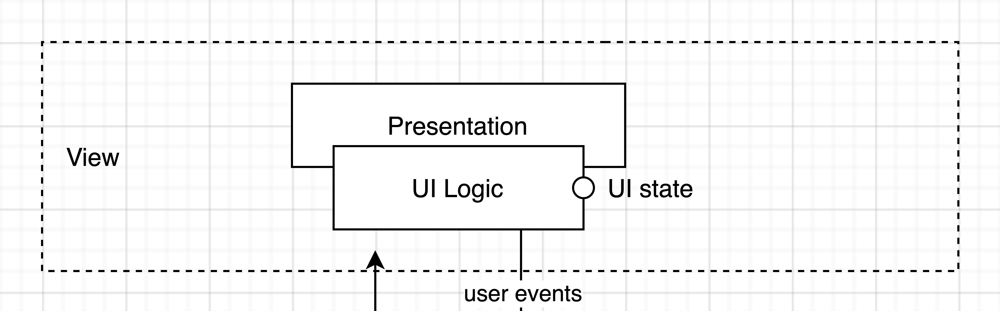

# View layer (React Component)

The View layer is the actual UI part of the frontend application. This layer presents data to to the user and allows the user to trigger certain user events.
The `components` directory consists only of fully reusable React Components.

The View layer is broken up in 2 separate sub-layers:
1. **The Presentation layer**: The visual styling and layout of the component.
2. **The UI logic**: The logic behind this specific component. This is what is being tested in unit tests.

---

## What does it do?
1. Present data to the user.
2. Allow user events to be triggered.

## Files in a View layer (React Component) directory:
* `<name>.tsx`: The layout of the component.
* `<name>Style.tsx`: The styling of the component.
* `use<name>.ts`: The UI logic of the component.
* `<name>.test.ts`: Lists all the features of the UI logic and runs unit tests for them.

*(Tip: Ever forget what the UI logic should do? Hover over the `UILogic` type in your code.)*
