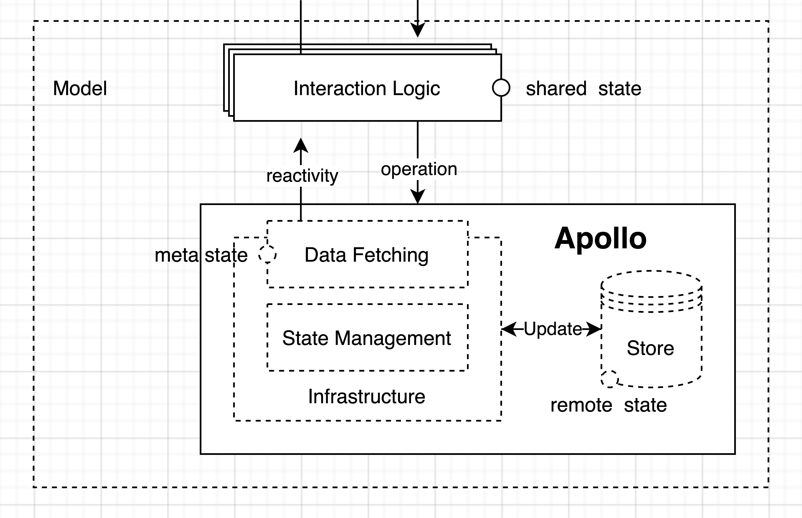

# Interaction layer

The Interaction layer is the decision making layer. This layer determines what we can or can't do with our domain throughout the application. It enforces consistency by centralizing Domain Interaction Logic. Every hook in this directory is meant to be reuseable and handles only one domain or concern. (validation, todos, albums). You should see every hook as an expert in its field.

*(Example: When we want to execute `createTodo` we might want to do some frontend validation before we execute the API request. We want to make sure that every instance of `createTodo` enforces the same rules.)*

Some Interaction layer logic might enforce rules which are specific to this application. (useTodos, useAlbums).
While others might be reusable throughout multiple projects. (useValidation, useAuth).

---

## What does it do?
1. Map API DTOs* to useable models.
2. Enforce rules and consistent behavior throughout the application.

## Files in an Interaction layer directory:
* `use<name>.ts`: The hook that determines which models and operations the app has access to and the behavior behind them.
* `use<name>.test.ts`: Lists all the features of the Interaction layer domain and runs unit tests for them.
* `<name>Mapper`: Maps DTOs* to useable models or vice versa.
* `*.graphql`: All mutations necessary to enable every feature from this domain.
* `/models`: All domain-specific TypeScript declaration files.

GraphQL mutations will only be used by their respective Interaction layer domain. This makes it useful to place the actual GraphQL files as close to their Interaction layer as possible. Doing this makes it easier to reason about why certain fields are requested and allows us to generate Interaction layer specific types as close as possible to the actual domain.

Interaction layer domains have their own TypeScript declaration files. They decide what our useable models look like after the Interaction layer mapped them from the raw API DTOs*. These are the models we will use throughout our application.

---

*1 Data Transfer Object: An object used to send Data between a frontend application and a backend application. Anything send to- or received from an API is a Data Transfer Object.

*(Tip: Ever forget what an Interaction Layer hook should do? Hover over the `InteractionLogic` type in your code.)*
